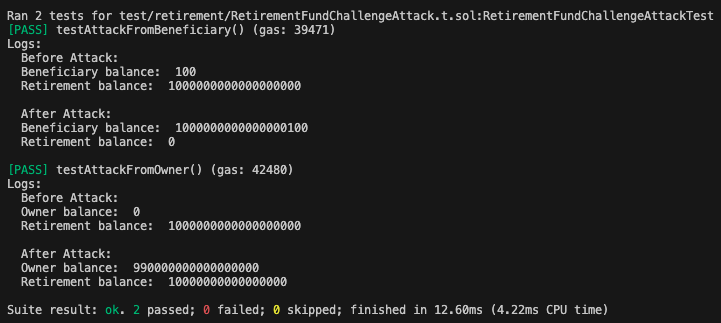
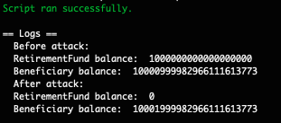

# Smart Contract Audit Report

## 🧾 Project Overview
This repository contains the security assessment of a Solidity smart contract responsible for handling withdrawals and beneficiary logic.  
During the review, several critical and moderate vulnerabilities were identified, alongside general recommendations for security and code quality improvements.

---

## ⚠️ Summary of Findings

| Severity | Issue | Impact |
|-----------|--------|--------|
| **High** | Missing verification for whether `withdraw()` has already been called (`isComplete()`), allowing the owner to drain funds through multiple withdrawals. | **Critical – Total fund drain possible** |
| **High** | Beneficiary can exploit an **underflow** vulnerability due to the outdated Solidity version, enabling unauthorized withdrawals. | **Critical – Fund theft possible** |
| **Medium** | Solidity version is significantly outdated (`^0.4.x`), exposing the contract to arithmetic underflow/overflow risks. | **Medium – Arithmetic integrity compromised** |
| **Medium** | Use of `address(this).balance` instead of an internal variable to track balance; the contract’s balance can be manipulated via external ETH transfers. | **Medium – Inconsistent internal state** |
| **Low** | Missing zero address validation in constructor | **Low – Invalid beneficiary** |
| **Low** | Reliance on `block.timestamp`, which can be slightly manipulated by miners. | **Low – Negligible impact in this context** |

---

## 🔍 Detailed Observations

### 1. Missing State Check on `withdraw()`
**Description:**  
The function `withdraw()` does not check whether it has already been executed (`isComplete`), allowing multiple calls and draining of the contract’s balance.

**Recommendation:**  
Add a state control mechanism:
```solidity
require(!isComplete, "Withdraw already executed");
isComplete = true;
```

### 2. Underflow Vulnerability

**Description:**
The outdated compiler version does not include built-in overflow and underflow checks.
Arithmetic operations such as balance -= amount; can result in incorrect balances and exploitation.

Recommendation:

Update to pragma solidity ^0.8.0 or higher.

Newer versions include automatic overflow/underflow protection.

### 3. Using address(this).balance

**Description:**
The contract directly references address(this).balance for withdrawals.
This can be manipulated by external ETH transfers, leading to incorrect logic and inconsistent states.

Recommendation:
Use an internal variable to track contract balances:

```solidity
uint256 private internalBalance;
```

Manually update it within deposit() and withdraw() functions.

### 4. Public Visibility of Functions

**Description:**
Functions declared as public can be called both internally and externally, which may expose unintended behaviors.

Recommendation:
Use external when functions are meant to be called only from outside the contract:
```solidity
function withdraw() external onlyOwner { ... }
```

### 5. Use of .transfer()

**Description:**
The .transfer() function forwards only 2300 gas and can cause reverts if the receiver is a contract that requires more gas in its fallback.

Recommendation:
Use .call{value: amount}("") instead, and verify its return value:

```solidity
(bool sent, ) = payable(msg.sender).call{ value: amount }("");
require(sent, "Transfer failed");
```

### 6. Missing Access Control on withdraw()

**Description:**
The withdraw() function can be called by anyone, allowing unauthorized fund withdrawals.

Recommendation:
Add access control using OpenZeppelin’s Ownable modifier:

```solidity
import "@openzeppelin/contracts/access/Ownable.sol";

function withdraw() external onlyOwner {
    ...
}
```

## 🛠 Suggested Fix Summary
Category	| Recommendation 
--|--
Security	| Add onlyOwner modifier to withdraw()
Logic	| Add isComplete state control
Compiler	| Update Solidity version to ^0.8.0
Best Practice |	Replace .transfer() with .call()
Best Practice | Check that the address is not zero
Integrity | Track balance with an internal variable
Visibility	| Use external instead of public

## ▶️ How to run the project

**Prerequisites**
- Foundry (forge & cast) installed.
- Anvil (local Ethereum node) available if running locally.

**Run tests (with logs)**
From the project root, run:
```solidity
forge t -vv
```


This executes the test suite with verbose logs (useful to display console.log outputs and detailed failure traces).

**Run locally (deploy and execute script)**
1. Start a local Anvil node. The example below sets block production to one block every 10 seconds:

```solidity
anvil -b 10
```

The -b 10 flag makes Anvil produce new blocks every 10 seconds (useful to simulate time-dependent behavior).

2. Deploy the script and broadcast the transaction to the local node (this will publish the contract and execute the included script, e.g., running the attack scenario):
```solidity
forge script script/Retirement.s.sol:RetirementScript --rpc-url "http://127.0.0.1:8545" --broadcast
```


This command compiles and runs the RetirementScript script, broadcasting transactions to the Anvil instance running at http://127.0.0.1:8545.

**Notes**

Ensure Anvil is running before executing the forge script command.

Use --broadcast to send real transactions to the specified RPC; omit it for a dry run.

If your script requires specific private keys or environment variables, set them accordingly (e.g., via export or a .env file) prior to broadcasting.

## 📘 Conclusion

The audit identified critical vulnerabilities that could lead to total fund loss if exploited.
The following improvements are strongly recommended:

- Update Solidity version to ^0.8.0 or newer.
- Replace .transfer() with .call() for safer fund transfers.
- Implement access control using OpenZeppelin’s Ownable.
- Implementing these changes will significantly enhance the security, maintainability, and reliability of the smart contract.

### Auditor:

👤 Lucas Gonçalves de Campos

📅 November 2025

🔗 Blockchain Security – Solidity
